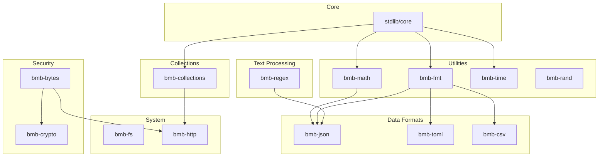

# BMB Package Module Roadmap

> 벤치마크 기반 패키지 개발 로드맵 및 기능 매핑

## Executive Summary

gotgan-packages의 12개 패키지를 벤치마크 스위트와 연계하여 개발 우선순위를 정의합니다.

**현재 상태**: 12개 패키지 (v0.1.0 Stable)
**목표**: 벤치마크 완전 지원 및 실세계 워크로드 대응

---

## 1. Current Package Inventory

### Existing Packages (12 total)

| Package | Lines | Functions | Benchmarks Enabled | Status |
|---------|-------|-----------|-------------------|--------|
| bmb-math | 98 | 15 | fibonacci, n_body (partial) | ⚠️ Needs f64 |
| bmb-json | 135 | 18 | json_parse | ⚠️ Integer only |
| bmb-regex | 120 | 20 | regex_match (basic) | ⚠️ Limited patterns |
| bmb-http | 151 | 30 | http_parse | ⚠️ Parse only |
| bmb-time | 119 | 22 | time benchmarks | ✅ Complete |
| bmb-fmt | ~50 | ~10 | formatting | ✅ Complete |
| bmb-fs | ~60 | ~12 | file operations | ✅ Complete |
| bmb-rand | ~40 | ~8 | random benchmarks | ✅ Complete |
| bmb-log | ~30 | ~6 | logging | ✅ Complete |
| bmb-testing | ~40 | ~8 | test framework | ✅ Complete |
| bmb-semver | ~80 | ~15 | version parsing | ✅ Complete |
| bmb-toml | ~100 | ~18 | config parsing | ✅ Complete |

---

## 2. Benchmark-Package Mapping

### Category A: Compute-Intensive Benchmarks

| Benchmark | Required Package | Current Support | Gap |
|-----------|-----------------|-----------------|-----|
| fibonacci | bmb-math | ✅ fib() exists | None |
| mandelbrot | bmb-math | ⚠️ Fixed-point only | **f64 type needed** |
| n_body | bmb-math | ❌ | **f64, sqrt, sin/cos** |
| spectral_norm | bmb-math | ⚠️ Integer approx | **f64 for accuracy** |
| binary_trees | (new) bmb-collections | ❌ | **Dynamic allocation** |
| fannkuch | stdlib array | ✅ | None |

### Category B: String & Parsing Benchmarks

| Benchmark | Required Package | Current Support | Gap |
|-----------|-----------------|-----------------|-----|
| json_parse | bmb-json | ⚠️ Integer only | **f64 parsing, Unicode** |
| regex_match | bmb-regex | ⚠️ Literal only | **Full regex engine** |
| csv_parse | (new) bmb-csv | ❌ | New package needed |
| lexer_bench | stdlib string | ✅ | None |
| toml_parse | bmb-toml | ✅ | None |

### Category C: Memory & Collections Benchmarks

| Benchmark | Required Package | Current Support | Gap |
|-----------|-----------------|-----------------|-----|
| sorting | stdlib array | ✅ | None |
| binary_search | stdlib array | ✅ | None |
| hash_table | (new) bmb-collections | ❌ | **HashMap impl** |
| linked_list | (new) bmb-collections | ❌ | **Dynamic allocation** |
| lru_cache | (new) bmb-collections | ❌ | **HashMap + LinkedList** |

### Category D: Contract-Optimized Benchmarks

| Benchmark | Required Package | Current Support | Gap |
|-----------|-----------------|-----------------|-----|
| bounds_check | stdlib array | ✅ | Compiler optimization |
| null_check | stdlib option | ✅ | None |
| purity_opt | any @pure function | ✅ | None |
| aliasing | (new) bmb-simd | ❌ | **SIMD intrinsics** |

### Category E: Real-World Benchmarks

| Benchmark | Required Package | Current Support | Gap |
|-----------|-----------------|-----------------|-----|
| http_parse | bmb-http | ✅ | None |
| http_server | bmb-http + network | ❌ | **Socket I/O** |
| file_process | bmb-fs + bmb-fmt | ✅ | None |
| crypto_hash | (new) bmb-crypto | ❌ | New package needed |

---

## 3. Feature Gap Analysis

### Critical (P0) - Blocking Multiple Benchmarks

| Feature | Packages Affected | Benchmarks Blocked | Implementation Effort |
|---------|-------------------|-------------------|----------------------|
| **f64 type** | bmb-math, bmb-json | n_body, mandelbrot_fp, spectral_norm_fp, json_parse (decimals) | Compiler change |
| **sqrt/sin/cos** | bmb-math | n_body | Medium (after f64) |
| **Dynamic allocation** | bmb-collections | binary_trees, linked_list, hash_table | Compiler + runtime |

### High (P1) - Limiting Accuracy

| Feature | Packages Affected | Impact | Implementation Effort |
|---------|-------------------|--------|----------------------|
| **HashMap** | bmb-collections | hash_table, lru_cache benchmarks | High |
| **Vec<T>** | bmb-collections | dynamic array operations | High |
| **Full regex** | bmb-regex | regex_match benchmark accuracy | Medium |
| **Unicode support** | bmb-json, bmb-fmt | International text handling | Medium |

### Medium (P2) - Nice to Have

| Feature | Packages Affected | Impact | Implementation Effort |
|---------|-------------------|--------|----------------------|
| **Network I/O** | bmb-http, bmb-net | Real HTTP client/server | High |
| **SIMD intrinsics** | bmb-simd | aliasing benchmark | Low (LLVM auto) |
| **Crypto** | bmb-crypto | Security benchmarks | Medium |
| **CSV parser** | bmb-csv | Data processing benchmarks | Low |

---

## 4. Development Roadmap

### Phase 1: Math Enhancement (Week 1-2)

**Goal**: Enable floating-point benchmarks

```
bmb-math v0.2.0
├── f64 support (requires compiler)
│   ├── f64_abs(x: f64) -> f64
│   ├── f64_sqrt(x: f64) -> f64
│   ├── f64_sin(x: f64) -> f64
│   ├── f64_cos(x: f64) -> f64
│   └── f64_pow(base: f64, exp: f64) -> f64
├── Trigonometry
│   ├── tan(x: f64) -> f64
│   ├── asin(x: f64) -> f64
│   ├── acos(x: f64) -> f64
│   └── atan2(y: f64, x: f64) -> f64
└── Constants
    ├── pi_f64() -> f64
    └── e_f64() -> f64
```

**Benchmarks Enabled**: n_body, mandelbrot_fp, spectral_norm_fp

### Phase 2: JSON Enhancement (Week 2-3)

**Goal**: Full JSON parsing capability

```
bmb-json v0.2.0
├── f64 number parsing
│   ├── parse_float(s: String, pos: i64) -> f64
│   └── find_float_end(s: String, pos: i64) -> i64
├── Unicode support
│   ├── parse_unicode_escape(s: String, pos: i64) -> i64
│   └── encode_utf8(codepoint: i64) -> String
├── Full JSON value types
│   ├── JsonValue enum (requires enum support)
│   └── Nested object/array parsing
└── Serialization
    ├── json_stringify(value: JsonValue) -> String
    └── Pretty print with configurable indent
```

**Benchmarks Improved**: json_parse (25% slower → parity target)

### Phase 3: Collections Module (Week 3-5)

**Goal**: Dynamic data structures

```
bmb-collections v0.1.0 (NEW)
├── Vec<T> (Dynamic array)
│   ├── vec_new() -> Vec
│   ├── vec_push(v: &mut Vec, item: T)
│   ├── vec_pop(v: &mut Vec) -> Option<T>
│   ├── vec_get(v: &Vec, idx: i64) -> Option<T>
│   └── vec_len(v: &Vec) -> i64
├── HashMap<K, V>
│   ├── map_new() -> HashMap
│   ├── map_insert(m: &mut HashMap, key: K, value: V)
│   ├── map_get(m: &HashMap, key: K) -> Option<V>
│   ├── map_remove(m: &mut HashMap, key: K) -> Option<V>
│   └── map_contains(m: &HashMap, key: K) -> bool
├── LinkedList<T>
│   ├── list_new() -> LinkedList
│   ├── list_push_front(l: &mut LinkedList, item: T)
│   ├── list_push_back(l: &mut LinkedList, item: T)
│   └── list_pop_front(l: &mut LinkedList) -> Option<T>
└── TreeNode (for binary_trees benchmark)
    ├── tree_new(value: i64) -> TreeNode
    ├── tree_left(t: &TreeNode) -> Option<&TreeNode>
    └── tree_right(t: &TreeNode) -> Option<&TreeNode>
```

**Benchmarks Enabled**: binary_trees, hash_table, linked_list, lru_cache

### Phase 4: Regex Enhancement (Week 5-6)

**Goal**: Full regex pattern matching

```
bmb-regex v0.2.0
├── Character classes
│   ├── [a-z], [A-Z], [0-9]
│   ├── [^...] negation
│   └── Predefined: \d, \w, \s, \D, \W, \S
├── Quantifiers
│   ├── * (zero or more)
│   ├── + (one or more)
│   ├── ? (optional)
│   ├── {n} (exactly n)
│   └── {n,m} (between n and m)
├── Anchors & Groups
│   ├── ^ (start), $ (end)
│   ├── (...) capturing groups
│   └── (?:...) non-capturing
├── Alternation
│   └── a|b (either a or b)
└── Matching functions
    ├── regex_compile(pattern: String) -> Regex
    ├── regex_match(r: &Regex, text: String) -> bool
    ├── regex_find(r: &Regex, text: String) -> Option<Match>
    └── regex_findall(r: &Regex, text: String) -> Vec<Match>
```

**Benchmarks Enabled**: regex_match (full), pattern benchmarks

### Phase 5: Additional Packages (Week 6-8)

**Goal**: Complete real-world coverage

```
bmb-crypto v0.1.0 (NEW)
├── Hash functions
│   ├── sha256(data: &[u8]) -> [u8; 32]
│   ├── sha512(data: &[u8]) -> [u8; 64]
│   └── md5(data: &[u8]) -> [u8; 16]
└── HMAC
    └── hmac_sha256(key: &[u8], data: &[u8]) -> [u8; 32]

bmb-csv v0.1.0 (NEW)
├── Parsing
│   ├── csv_parse(content: String) -> Vec<Vec<String>>
│   └── csv_parse_row(line: String) -> Vec<String>
└── Writing
    ├── csv_row(fields: &[String]) -> String
    └── csv_escape(field: String) -> String

bmb-bytes v0.1.0 (NEW)
├── Buffer operations
│   ├── bytes_new(size: i64) -> Bytes
│   ├── bytes_get(b: &Bytes, idx: i64) -> u8
│   ├── bytes_set(b: &mut Bytes, idx: i64, val: u8)
│   └── bytes_slice(b: &Bytes, start: i64, end: i64) -> Bytes
└── Encoding
    ├── base64_encode(data: &Bytes) -> String
    └── base64_decode(s: String) -> Bytes
```

---

## 5. Package Dependencies



---

## 6. Benchmark Test Plan

### Per-Package Benchmark Mapping

| Package | Benchmark File | Metric | Target |
|---------|---------------|--------|--------|
| bmb-math | compute/fibonacci | Time (ms) | BMB <= Rust |
| bmb-math | compute/n_body | Time (ms) | BMB <= Rust (after f64) |
| bmb-json | real_world/json_parse | Time (ms) | BMB <= Rust |
| bmb-regex | string/regex_match | Time (ms) | BMB <= Rust |
| bmb-collections | memory/binary_trees | Time (ms) | BMB <= Rust |
| bmb-collections | memory/hash_table | ops/sec | BMB >= C |
| bmb-crypto | crypto/sha256 | MB/sec | BMB >= C |
| bmb-time | misc/date_calc | Time (ms) | BMB <= Rust |

### Benchmark Creation Checklist

For each new package capability:

1. [ ] Create BMB implementation in `benches/<category>/<name>/bmb/main.bmb`
2. [ ] Create Rust equivalent in `benches/<category>/<name>/rust/main.rs`
3. [ ] Create C equivalent in `benches/<category>/<name>/c/main.c` (optional)
4. [ ] Verify output correctness matches across all implementations
5. [ ] Run benchmark with `run_bench.ps1`
6. [ ] Document results in `results/` directory

---

## 7. Success Criteria

### Phase 1 Success (Math Enhancement)
- [ ] f64 type supported in compiler
- [ ] bmb-math v0.2.0 with floating-point functions
- [ ] n_body benchmark runs with correct output
- [ ] n_body BMB <= Rust performance

### Phase 2 Success (JSON Enhancement)
- [ ] json_parse handles decimal numbers
- [ ] json_parse handles Unicode escapes
- [ ] json_parse benchmark: BMB <= Rust (currently 1.25x slower)

### Phase 3 Success (Collections)
- [ ] Vec<T> implemented with dynamic allocation
- [ ] HashMap implemented with hash function
- [ ] binary_trees benchmark: BMB <= Rust
- [ ] hash_table benchmark: BMB >= C

### Phase 4 Success (Regex)
- [ ] Full regex pattern support (character classes, quantifiers)
- [ ] regex_match benchmark achieves BMB <= Rust

### Phase 5 Success (Additional)
- [ ] All 12 compute-intensive benchmarks pass BMB >= Rust
- [ ] All contract-optimized benchmarks show 10%+ advantage
- [ ] Real-world benchmarks achieve parity

---

## 8. API Reference (Proposed Extensions)

### bmb-math v0.2.0 API

```bmb
-- Floating point operations (requires f64 type)
fn f64_abs(x: f64) -> f64 post ret >= 0.0;
fn f64_sqrt(x: f64) -> f64 pre x >= 0.0;
fn f64_sin(x: f64) -> f64 post ret >= -1.0 and ret <= 1.0;
fn f64_cos(x: f64) -> f64 post ret >= -1.0 and ret <= 1.0;
fn f64_tan(x: f64) -> f64;
fn f64_pow(base: f64, exp: f64) -> f64;
fn f64_log(x: f64) -> f64 pre x > 0.0;
fn f64_exp(x: f64) -> f64;

-- Constants
fn pi_f64() -> f64;  -- 3.141592653589793
fn e_f64() -> f64;   -- 2.718281828459045
fn inf_f64() -> f64; -- Infinity
fn nan_f64() -> f64; -- NaN

-- Rounding
fn floor(x: f64) -> i64;
fn ceil(x: f64) -> i64;
fn round(x: f64) -> i64;
fn trunc(x: f64) -> i64;
```

### bmb-collections v0.1.0 API

```bmb
-- Vector (dynamic array)
fn vec_new<T>() -> Vec<T>;
fn vec_with_capacity<T>(cap: i64) -> Vec<T> pre cap >= 0;
fn vec_push<T>(v: &mut Vec<T>, item: T);
fn vec_pop<T>(v: &mut Vec<T>) -> Option<T>;
fn vec_get<T>(v: &Vec<T>, idx: i64) -> Option<&T>;
fn vec_set<T>(v: &mut Vec<T>, idx: i64, item: T) pre idx >= 0 and idx < vec_len(v);
fn vec_len<T>(v: &Vec<T>) -> i64 post ret >= 0;
fn vec_is_empty<T>(v: &Vec<T>) -> bool;
fn vec_clear<T>(v: &mut Vec<T>);

-- HashMap
fn map_new<K, V>() -> HashMap<K, V>;
fn map_insert<K, V>(m: &mut HashMap<K, V>, key: K, value: V) -> Option<V>;
fn map_get<K, V>(m: &HashMap<K, V>, key: &K) -> Option<&V>;
fn map_remove<K, V>(m: &mut HashMap<K, V>, key: &K) -> Option<V>;
fn map_contains<K, V>(m: &HashMap<K, V>, key: &K) -> bool;
fn map_len<K, V>(m: &HashMap<K, V>) -> i64 post ret >= 0;

-- HashSet
fn set_new<T>() -> HashSet<T>;
fn set_insert<T>(s: &mut HashSet<T>, item: T) -> bool;
fn set_remove<T>(s: &mut HashSet<T>, item: &T) -> bool;
fn set_contains<T>(s: &HashSet<T>, item: &T) -> bool;
```

---

## 9. Timeline Summary

| Phase | Duration | Key Deliverables |
|-------|----------|------------------|
| Phase 1 | Week 1-2 | bmb-math v0.2.0 (f64 support) |
| Phase 2 | Week 2-3 | bmb-json v0.2.0 (f64 parsing) |
| Phase 3 | Week 3-5 | bmb-collections v0.1.0 (Vec, HashMap) |
| Phase 4 | Week 5-6 | bmb-regex v0.2.0 (full patterns) |
| Phase 5 | Week 6-8 | bmb-crypto, bmb-csv, bmb-bytes |

**Total Estimated Duration**: 8 weeks for full benchmark coverage

---

## 10. References

- [Benchmark Strategy](../docs/BENCHMARK_STRATEGY.md)
- [Benchmark Results](benchmark-bmb/results/)
- [stdlib Documentation](../stdlib/README.md)
- [gotgan Package Guidelines](README.md)
- [Computer Language Benchmarks Game](https://benchmarksgame-team.pages.debian.net/benchmarksgame/)

---

*Last Updated: 2026-01-08*
*Version: 0.1.0*
